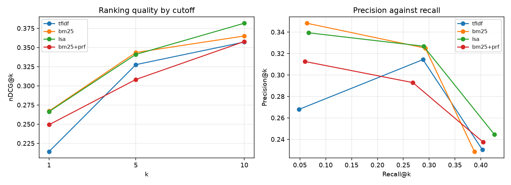
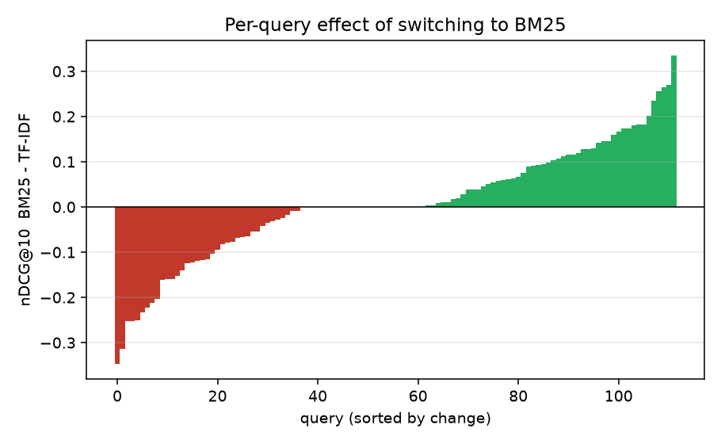
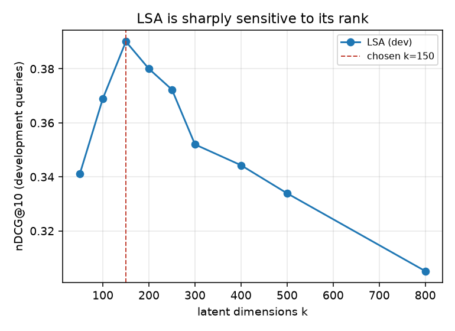

# Cranfield Search Engine

An information retrieval system built from scratch on the Cranfield 1400 test
collection — inverted index, four retrieval models, and an evaluation harness
that reports whether the differences between them are real.

Course project for **CS6370 Natural Language Processing**, IIT Madras.

```bash
scripts/fetch_data.sh                                  # 1400 abstracts, 225 queries
pip install -r requirements.txt
python -m ir.cli search "effect of sweep angle on boundary layer transition"
python -m ir.cli evaluate --all                        # the table below
python -m experiments.run_all                          # every number in this README
```

## The result

Four models, tuned on 113 development queries and scored on the 112 held-out
ones. Ranked by nDCG@10:

| model | P@10 | R@10 | nDCG@10 | MAP | ms/query | p vs TF-IDF |
|---|---|---|---|---|---|---|
| LSA (k=150) | **0.245** | **0.426** | **0.382** | **0.313** | 0.9 | 0.093 |
| BM25 (k1=1.5, b=0.5) | 0.229 | 0.388 | 0.365 | 0.288 | 0.6 | 0.505 |
| TF-IDF cosine | 0.230 | 0.403 | 0.357 | 0.277 | 0.6 | — |
| BM25 + pseudo-relevance feedback | 0.238 | 0.404 | 0.358 | 0.299 | 2.0 | 0.961 |

LSA wins. **But none of these differences are statistically significant**, and
that is the finding worth reporting.

A paired bootstrap over per-query scores puts LSA's +0.025 nDCG@10 at p = 0.09
and BM25's +0.008 at p = 0.51. Inverting the sample-size formula on the
observed variance says you would need **311 queries** to resolve the LSA gap at
80% power, and **1987** to resolve the BM25 one. Cranfield has 225. Per-query
nDCG@10 has a standard deviation of about 0.25 — ten to thirty times the gaps
between the systems — so the test collection simply cannot see them.

This reframes the whole exercise. The published Cranfield comparisons that
report a model ranking to three decimal places are, on this evidence, mostly
reporting noise. What can be concluded is narrower and more honest: all four
models are within measurement error of each other, LSA is the best guess if you
must pick one, and pseudo-relevance feedback is the only intervention that
looks actively harmful (−0.007, and it costs 3× the latency).



The per-query view shows why the means are untrustworthy. Switching from TF-IDF
to BM25 helps 50 queries, hurts 37 and leaves 25 unchanged; the +0.008 mean is
the near-cancellation of two large opposing effects, not a consistent gain:



## Where the retrieval quality actually comes from

Since the model choice is unmeasurable, the ablation on the *preprocessing*
pipeline is the more informative experiment. BM25 held fixed, one stage changed
at a time, development queries:

| pipeline | vocabulary | nDCG@10 | MAP | p vs baseline |
|---|---|---|---|---|
| naive segmentation + naive tokenisation, no normalisation | 8474 | 0.338 | 0.275 | — |
| + Punkt sentence segmentation | 8474 | 0.338 | 0.275 | 1.000 |
| + Penn Treebank tokenisation | 8299 | 0.334 | 0.274 | 0.540 |
| + Porter stemming | 5672 | 0.355 | 0.299 | 0.295 |
| + WordNet lemmatisation (instead of stemming) | 6481 | 0.338 | 0.285 | 0.966 |
| **+ Porter stemming + NLTK stopwords** | **5566** | **0.361** | **0.311** | 0.166 |
| + Porter stemming + top-50 collection-frequency stopwords | 5636 | 0.339 | 0.281 | 0.939 |

Four things fall out of this table, none of them what the pipeline's reputation
would predict:

- **Punkt segmentation changes nothing.** Byte-identical vocabulary, identical
  scores. Punkt only rescues abbreviations in its trained model — it handles
  "Dr." and misses "fig." and "no.", which are the ones Cranfield's prose
  actually uses. Sentence boundaries then turn out not to matter anyway,
  because the downstream model is a bag of words that reassembles them.
- **Treebank tokenisation makes things slightly worse.** It splits clitics and
  hyphenated compounds that are single technical terms here
  ("boundary-layer"), fragmenting exactly the rare, high-IDF terms that carry
  the retrieval signal.
- **Stemming beats lemmatisation, decisively.** Porter cuts the vocabulary by
  a third and gains 0.017 nDCG@10; WordNet lemmatisation cuts it by a fifth and
  gains 0.000. Lemmatisation is the linguistically correct operation and the
  wrong one for retrieval: it preserves distinctions ("flow" / "flowing") that
  a searcher does not intend, while stemming's aggressive, ungrammatical
  conflation ("boundary" → "boundari") is precisely what matching wants.
- **A generic stopword list beats one derived from the collection.** The
  data-driven list removes the 50 commonest terms, which in a single-domain
  aerodynamics corpus means removing *flow*, *pressure*, *boundary* — terms
  that are frequent but not uninformative, because the queries are about them
  too. IDF already discounts them correctly; deleting them destroys real
  signal.

The winning pipeline is used by everything downstream, so it is `ir.text.DEFAULT`.

## LSA's rank matters more than the choice of model

Sweeping the truncation rank moves nDCG@10 from 0.30 to 0.38 — a range four
times wider than the spread between the four models:



Too few dimensions and distinct aerodynamic topics collapse onto one another;
too many and the trailing singular vectors re-introduce the term-level noise
the truncation existed to remove. The peak sits near k = 150, about 2.7% of the
5566-term vocabulary.

This is also the reason the whole experiment uses a query split, and the effect
of skipping it is not subtle. Run `python -m ir.cli evaluate --all`, which
scores all 225 queries with the tuned k = 150 — including the 113 that chose
it — and LSA's advantage over TF-IDF grows from +0.025 to +0.033 and its
p-value falls from **0.093 to 0.0017**. The same code and the same models turn
a null result into a significant one, purely by reporting on the queries the
hyperparameter was fitted to.

So every hyperparameter here (LSA rank, BM25 k1 and b) is chosen on the
odd-numbered queries and every number in the tables above comes from the
even-numbered ones.

## Where it still fails

14 of the 112 held-out queries score exactly zero at nDCG@10 — nothing relevant
in the top ten. Two things it is *not*: out-of-vocabulary query terms (only 29
distinct terms out of 2234 query tokens miss the index at all, and none of them
occur in the failing queries), and query length (correlation with nDCG@10 is
−0.07, i.e. nothing).

Reading the failures, they share a shape. They are the queries that ask about a
*relationship* rather than a topic:

> *"does transition in the hypersonic wake depend on body geometry and size?"*
> *"can the procedure of matching inner and outer solutions be justified?"*

Every content term here is common in the collection. A bag-of-words model
retrieves documents about hypersonic wakes and documents about body geometry;
what the query wants is the document about the dependence *between* them, and
term matching has no representation for "depends on". This is the vocabulary
mismatch problem's harder cousin — a structural mismatch — and it is what
neither stemming nor LSA nor feedback can touch.

## Design notes

**The collection has three traps**, each of which silently corrupts every
downstream score without raising an error. All three are handled in `ir/data.py`
and pinned by tests in `tests/test_data.py`:

1. **Query ids in `cran.qry` are not the query ids in `cranqrel`.** The `.I`
   labels run 1, 2, 4, … 365 with gaps; `cranqrel` numbers the same queries
   1–225 sequentially. Joining on `.I` agrees for the first two queries and
   mis-pairs every judgement after that. Queries are keyed by ordinal position.
2. **The relevance grades are inverted.** Cleverdon's scale runs 1 = "complete
   answer" down to 4 = "minimum interest". Feeding the raw grade to nDCG as a
   gain rewards the *worst* documents most. Grade g maps to gain 5 − g.
3. **Every query carries one spurious `-1` judgement** — 225 of the file's 1837
   rows, on 128 distinct documents. Keeping them adds a phantom relevant
   document to every query.

**Everything reads one index.** `InvertedIndex` holds term → {doc → tf} plus a
forward index and the collection statistics; TF-IDF, BM25 and LSA are three
ways of scoring the same postings. Scoring walks only the postings lists of the
query's terms, which is the entire reason an inverted index exists — sub-2ms
per query over 1400 documents on a laptop, with no vectorisation.

**Queries go through the document pipeline, always.** A stemmed index with an
unstemmed query returns nothing and raises no error; `tests/test_retrieval.py`
pins this.

**nDCG uses linear gain, not `2^g − 1`.** Cranfield's grades are a 4-point
judgement scale, not a utility on a ratio scale — the exponential form would
assert that a grade-1 document is 15× a grade-4 one.

**Ties break by document id**, so runs reproduce exactly across platforms.

## Layout

```
ir/
  data.py       loading the collection, and the three traps above
  text.py       preprocessing: segment -> tokenise -> normalise -> filter
  index.py      inverted index, forward index, collection statistics
  models.py     TF-IDF cosine, BM25, LSA, Rocchio feedback
  evaluate.py   P/R/F@k, MAP, nDCG, paired bootstrap, power analysis
  cli.py        search / evaluate / explain
experiments/
  run_all.py    the four experiments; regenerates results.json and the figures
tests/          53 tests
```

`python -m ir.cli explain 38` prints the analysed query, the ranking, which
documents were judged relevant, and the document frequency of every query term
— the tool used to produce the failure analysis above.

## Tests

```bash
python -m pytest tests -q          # 53 passed
```

The tests worth reading are the ones that pin the traps: metrics that are
subtly wrong still return plausible numbers, so `tests/test_evaluate.py` checks
each metric against a ranking whose score can be worked out by hand (that MAP
divides by the number of relevant documents and not by the number of hits; that
the nDCG discount is log2(rank+1); that reversing a ranking lowers nDCG, which
fails if the grade inversion is missed).

## References

- Cleverdon (1967), *The Cranfield tests on index language devices*
- Robertson & Walker (1994), *Some simple effective approximations to the 2-Poisson model* — BM25
- Deerwester et al. (1990), *Indexing by latent semantic analysis*
- Järvelin & Kekäläinen (2002), *Cumulated gain-based evaluation of IR techniques* — nDCG
- Smucker, Allan & Carterette (2007), *A comparison of statistical significance tests for IR evaluation*
